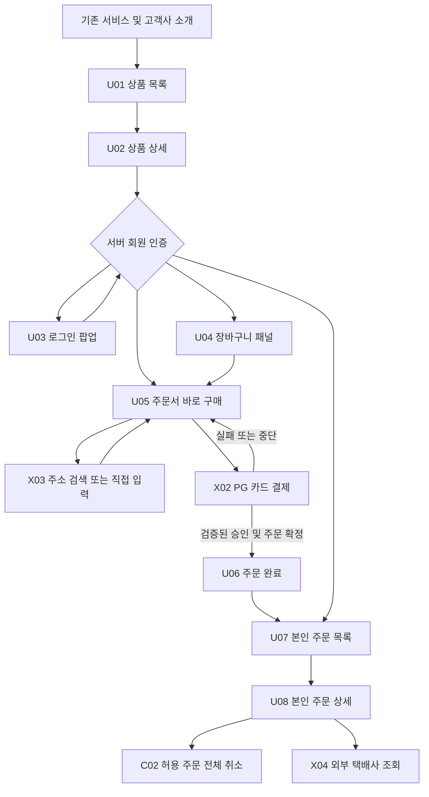
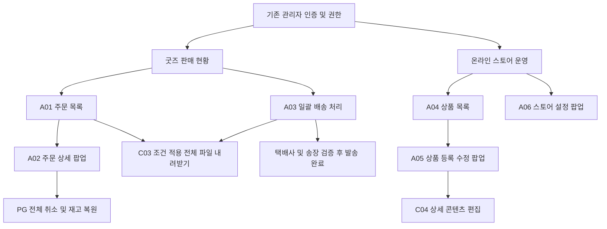

# 말마프렌즈 온라인 스토어 IA 구조도

사용자와 관리자 화면 구조 및 이동 정의

기획 개정안 v2.0  |  2026년 9월 18일  |  고객사 정책 및 개발 검토 전

회원이 여러 굿즈를 한 주문으로 구매하고, 관리자가 기존 예약 운영 시스템에서 상품·재고·주문·출고를 관리하는 구조로 재정리한다. 예약권과 굿즈의 상품·주문 데이터는 분리한다. 아래 구조는 최종 서비스의 기획 제안이며 실제 인증·결제 연동 완료를 뜻하지 않는다.

## 문서와 화면 식별 기준

| 구분 | 정의 |
| --- | --- |
| U 화면 | 사용자 페이지와 로그인 팝업 및 장바구니 패널 |
| A 화면 | 기존 관리자에 추가할 메뉴와 탭 및 팝업 |
| C 공통 동작 | 확인창 내려받기 편집 도구처럼 독립 메뉴가 아닌 기능 |
| X 외부 연동 | 기존 인증 PG 주소 검색 택배사 조회 |
| F 기능 | 기능명세서의 F01부터 F26까지 연결 |
| H 전달 정의 | 개발 전달서의 H01부터 H07까지 연결 |
| D 결정 항목 | 운영 정책 또는 범위 확정이 필요한 사항 |
| TC 검수 | 개발 전달서의 검수 시나리오 |

## 전체 메뉴 트리

렛츠런플레이 → 온라인 스토어 → 상품 목록 → 상품 상세. 로그인은 구매 행동과 주문 조회의 공통 진입 조건이다. 상품 상세에서 바로 구매 또는 장바구니 구매를 선택하고 주문서 → 외부 PG → 주문 완료로 진행한다. 주문 조회는 주문 목록 → 주문 상세 → 전체 취소 또는 외부 배송조회로 이어진다.

기존 관리자 → 굿즈 판매 현황 → 주문 목록 / 일괄 배송 처리. 주문 상세는 목록의 팝업이다. 기존 관리자 → 온라인 스토어 운영 → 상품 목록 → 상품 등록·수정 / 스토어 설정 팝업으로 구성한다.

## 사용자 IA 구조도

## 사용자 동선

탐색은 비로그인 허용, 구매와 주문 조회는 회원 전용이다. 구매 중 로그인 성공 시 원래 선택과 행동을 이어간다. 로그인 닫기는 구매 중단이며 주문을 생성하지 않는다.

주소 검색 X03은 U05 내 보조 팝업이다. 결제 결과 실패·중단은 U05로 돌아가고, 결과 미확정은 확인 중으로 안내한다. 결제 승인만 확인되고 주문 저장이 실패한 경우는 자동 복구와 운영 확인 대상이다.

## 관리자 IA 구조도

## 관리자 동선

A01 검색 → A02 주문 확인 → C03 출고 대상 내려받기 → 실제 포장·택배 접수 → A03 택배사·송장 입력 → 발송 완료. CSV 다운로드만으로 발송 상태가 변경되지 않는다.

A04 상품 선택 → A05 수정 → 저장 → 사용자 목록·상세 반영. A06 정책 변경은 새 주문에 적용하고, 기존 주문의 금액과 취소 기한은 보존한다.

## 사용자 화면 목록

| ID | 화면 및 형태 | 접근 | 현재 경로 | 기능 |
| --- | --- | --- | --- | --- |
| U01 | 스토어 메인 및 상품 목록 페이지 | 공개 | index.html / #products | F01 F02 |
| U02 | 상품 상세 페이지 | 공개 | #product/{id} | F03 F04 |
| U03 | 로그인 팝업 | 비로그인 | # 경로 없음 | F05 |
| U04 | 장바구니 패널 | 회원 | 경로 없음 | F06 |
| U05 | 주문서 페이지 | 회원 | #checkout | F07 F08 F09 |
| U06 | 주문 완료 페이지 | 주문 소유자 | #complete/{number} | F10 |
| U07 | 주문 목록 페이지 | 본인 주문 | #orders | F11 |
| U08 | 주문 상세 페이지 | 주문 소유자 | #orders/{number} | F12 F13 F14 |

## 공통 영역과 접근 처리

헤더는 상품 목록·주문 조회·장바구니 진입을 제공한다. 빈 장바구니는 숨김 대신 0개 상태 진입을 허용하는 개선 제안이다. 푸터는 고객센터·사업자 정보·기존 서비스 안내를 제공하며 공개 관리자 링크는 운영 URL·권한 정책에 맞춰 결정한다.

주문 목록·상세·완료 주소는 서버에서 로그인과 소유권을 검사한다. UI에서 감추는 것만으로 권한 처리를 대신하지 않는다. 존재하지 않거나 볼 수 없는 주문은 개인정보 없이 동일한 조회 불가 안내를 제공한다.

## 관리자 화면 목록과 경로 원칙

| ID | 화면 및 형태 | 접근 | 현재 식별자 | 기능 |
| --- | --- | --- | --- | --- |
| A01 | 굿즈 주문 목록 메뉴 및 탭 | 권한 관리자 | admin.html / sales / orders | F15 F16 |
| A02 | 관리자 주문 상세 팝업 | 권한 관리자 | detailDialog | F17 F18 |
| A03 | 일괄 배송 처리 탭 | 출고 권한 | sales / shipping | F19 F20 |
| A04 | 상품 목록 메뉴 | 상품 권한 | operationsView | F21 |
| A05 | 상품 등록 및 수정 팝업 | 상품 권한 | productDialog | F22 F23 F24 F25 |
| A06 | 스토어 설정 팝업 | 정책 권한 | settingsDialog | F26 |

## 현재 구조와 최종 서비스의 차이

현재 사용자 페이지는 해시 경로이며 관리자는 URL 변경 없이 탭과 팝업을 전환한다. 서버 경로 명칭은 제안 단계로, IA 화면 ID를 기준으로 상세 URL은 개발 설계에서 확정한다.

index.html에는 초기 관리자 패널과 상품 팝업 코드가 남아 있다. 최종 서비스 관리자 동작 기준은 admin.html로 통일하고 중복 패널을 제거하는 제안이다. app.js의 초기 함수보다 뒤에서 덮어쓰는 store-flow.js 동작을 우선 확인했다.

색상·배너·상품 이미지·반응형 화면 시안은 이번 IA의 범위를 넘는다. UX 검토의 모바일 고정 구매 영역, 관리자 고정 저장 버튼, 편집 내용 보존은 기능명세서와 전달서에 개선 요구로 연결한다.

## 편집 가능한 사용자 IA

## 편집 가능한 관리자 IA

