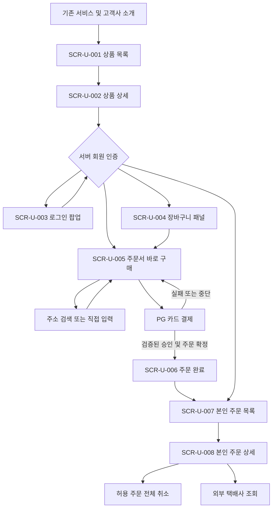
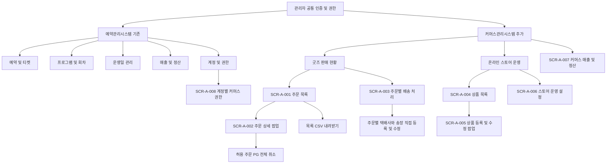

# 말마프렌즈 온라인 스토어 IA 구조도

사용자와 관리자 화면 구조 및 이동 정의

최종 개정안 v3.0  |  2026년 10월 1일  |  확정 정책 반영

회원이 여러 굿즈를 한 주문으로 구매하고, 관리자가 기존 관리자 안의 커머스관리시스템에서 상품·재고·주문·출고를 관리하는 구조로 재정리한다. 예약관리시스템과 커머스관리시스템은 메뉴 그룹 이름이며 별도 인증 서버나 별도 관리자 구축을 의미하지 않는다. 예약권과 굿즈의 상품·주문 데이터는 분리한다. 아래 구조는 최종 서비스의 기획 제안이며 실제 인증·결제 연동 완료를 뜻하지 않는다.

## 문서와 화면 식별 기준

| 구분 | 정의 |
| --- | --- |
| 화면 ID | SCR-U-001 사용자 화면 SCR-A-001 관리자 화면 형식 |
| 기능 ID | FN-001 기능명세와 화면 및 테스트 연결 |
| 테스트 ID | TC-001 개발 검수 상황과 기대 결과 연결 |
| 결정 항목 ID | DEC-001 미확정 운영 정책과 범위 결정 추적 |

## 식별 번호를 사용하는 이유

화면·기능·테스트에 고유 ID를 붙여 서로 연결하는 방식은 요구사항 추적을 위한 실무 관행이다. SCR-U·SCR-A·FN·TC·DEC는 이번 프로젝트의 명명 규칙이며 모든 IT 회사가 공통으로 사용하는 표준 코드가 아니다. 외부 연동과 공통 동작은 별도 ID 대신 이름으로 표시하고 개발 전달서의 장 번호는 일반 목차로 관리한다. 기존 v2 번호의 의미는 유지하면서 표기만 바꿨다.

## 전체 메뉴 트리

렛츠런플레이 → 온라인 스토어 → 상품 목록 → 상품 상세. 로그인은 구매 행동과 주문 조회의 공통 진입 조건이다. 상품 상세에서 바로 구매 또는 장바구니 구매를 선택하고 주문서 → 외부 PG → 주문 완료로 진행한다. 주문 조회는 주문 목록 → 주문 상세 → 전체 취소 또는 외부 배송조회로 이어진다.

관리자 안의 메뉴 그룹을 예약관리시스템과 커머스관리시스템으로 나눈다. 예약관리시스템의 계정·권한에는 계정별 `커머스 관리자 권한` 체크 항목을 별도로 두며 통합 관리자는 기본 부여한다. 커머스관리시스템 아래에는 상품 판매 현황, 배송 처리, 매출·정산, 온라인 스토어 운영을 배치한다. 배송 처리는 주문별 수동 송장 등록·수정만 제공하며 일괄 배송은 제공하지 않는다. 온라인 스토어 운영은 상품 관리, 메인 배너 관리, 스토어 운영 설정으로 구성한다.

## 사용자 IA 구조도

## 사용자 동선

탐색은 비로그인 허용, 구매와 주문 조회는 회원 전용이다. 구매 중 로그인 성공 시 원래 선택과 행동을 이어간다. 로그인 닫기는 구매 중단이며 주문을 생성하지 않는다.

주소 검색 주소 검색은 SCR-U-005 내 보조 팝업이다. 결제 결과 실패·중단은 SCR-U-005로 돌아가고, 결과 미확정은 확인 중으로 안내한다. 결제 승인만 확인되고 주문 저장이 실패한 경우는 자동 복구와 운영 확인 대상이다.

## 관리자 IA 구조도

## 관리자 동선

커머스관리시스템 → 상품 판매 현황에서 주문을 확인하고 필요하면 검색 조건 전체 결과를 내려받는다. 배송 처리에서는 주문별 택배사와 운송장번호를 직접 등록한다. 최초 등록 시 발송 완료로 전환하며 이후 운송장 삭제는 불가하고 수정만 허용한다. 일괄 배송, 송장 엑셀 업로드와 양식 다운로드는 제외한다. 매출·정산에서는 승인월 기준 원장·차감 이월액·다음 달 지급 예정일을 확인하고 개인정보 없이 XLSX로 내려받는다.

SCR-A-004 상품 선택 → SCR-A-005 수정 → 저장 → 사용자 목록·상세 반영. SCR-A-006 정책 변경은 새 주문에 적용하고, 기존 주문의 금액과 취소 기한은 보존한다.

## 사용자 화면 목록

| ID | 화면 및 형태 | 접근 | 현재 경로 | 기능 |
| --- | --- | --- | --- | --- |
| SCR-U-001 | 스토어 메인 및 상품 목록 페이지 | 공개 | index.html / #products | FN-001 FN-002 |
| SCR-U-002 | 상품 상세 페이지 | 공개 | #product/{id} | FN-003 FN-004 |
| SCR-U-003 | 로그인 팝업 | 비로그인 | # 경로 없음 | FN-005 |
| SCR-U-004 | 장바구니 패널 | 회원 | 경로 없음 | FN-006 |
| SCR-U-005 | 주문서 페이지 | 회원 | #checkout | FN-007 FN-008 FN-009 |
| SCR-U-006 | 주문 완료 페이지 | 주문 소유자 | #complete/{number} | FN-010 |
| SCR-U-007 | 주문 목록 페이지 | 본인 주문 | #orders | FN-011 |
| SCR-U-008 | 주문 상세 페이지 | 주문 소유자 | #orders/{number} | FN-012 FN-013 FN-014 |

## 공통 영역과 접근 처리

헤더는 상품 목록·주문 조회·장바구니 진입을 제공한다. 빈 장바구니는 0개 상태 진입을 허용한다. 푸터는 기존 고객센터·사업자 정보·서비스 안내를 유지하고 공개 관리자 링크는 노출하지 않는다.

주문 목록·상세·완료 주소는 서버에서 로그인과 소유권을 검사한다. UI에서 감추는 것만으로 권한 처리를 대신하지 않는다. 존재하지 않거나 볼 수 없는 주문은 개인정보 없이 동일한 조회 불가 안내를 제공한다.

## 관리자 화면 목록과 경로 원칙

| ID | 화면 및 형태 | 접근 | 현재 식별자 | 기능 |
| --- | --- | --- | --- | --- |
| SCR-A-001 | 굿즈 주문 목록 메뉴 및 탭 | 권한 관리자 | admin.html / sales / orders | FN-015 FN-016 |
| SCR-A-002 | 관리자 주문 상세 팝업 | 권한 관리자 | detailDialog | FN-017 FN-018 |
| SCR-A-003 | 주문별 배송 처리 화면 | 커머스 관리자 | sales / shipping | FN-019 FN-020 |
| SCR-A-004 | 상품 목록 메뉴 | 상품 권한 | operationsView | FN-021 |
| SCR-A-005 | 상품 등록 및 수정 팝업 | 상품 권한 | productDialog | FN-022 FN-023 FN-024 FN-025 |
| SCR-A-006 | 스토어 운영 설정 탭 | 커머스 관리자 | operationSettings | FN-026 |
| SCR-A-007 | 커머스 매출·정산 화면 | 커머스 관리자 | settlementView | FN-027 |
| SCR-A-008 | 계정별 커머스 권한 화면 | 통합 관리자 | accountsView | FN-028 |

## 현재 구조와 최종 서비스의 차이

현재 사용자 페이지는 해시 경로이며 관리자는 URL 변경 없이 탭과 팝업을 전환한다. 사이드바에는 예약관리시스템·커머스관리시스템 그룹이 반영되었다. 예약 그룹의 메뉴는 기존 사이트 링크이고 커머스 그룹은 현재 페이지 안에서 전환된다. 실제 인증·세션 통합 완료를 의미하지 않는다. 상단 브랜드명 예약 운영 시스템과 breadcrumb 통합 예약은 현재 코드에 남아 있어 공통 관리자 명칭으로 맞추는 개선 제안이다. 서버 경로 명칭은 제안 단계로, IA 화면 ID를 기준으로 상세 URL은 개발 설계에서 확정한다.

최종 서비스 관리자 동작 기준은 admin.html로 통일하고 사용자 index.html의 관리자 패널과 공개 관리자 링크는 제거한다.

색상·배너·상품 이미지·반응형 화면 시안은 이번 IA의 범위를 넘는다. UX 검토의 모바일 고정 구매 영역, 관리자 고정 저장 버튼, 편집 내용 보존은 기능명세서와 전달서에 개선 요구로 연결한다.

## 편집 가능한 사용자 IA

## 편집 가능한 관리자 IA

